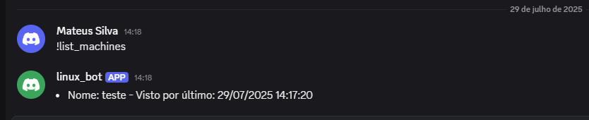
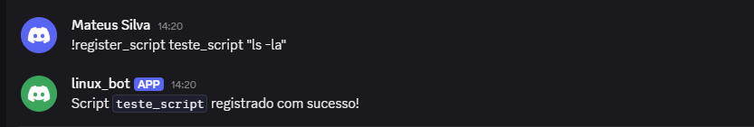
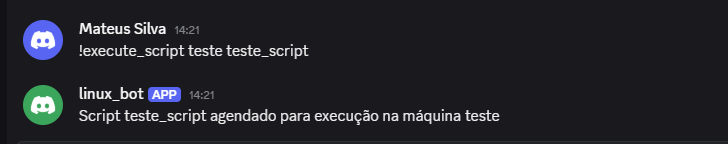
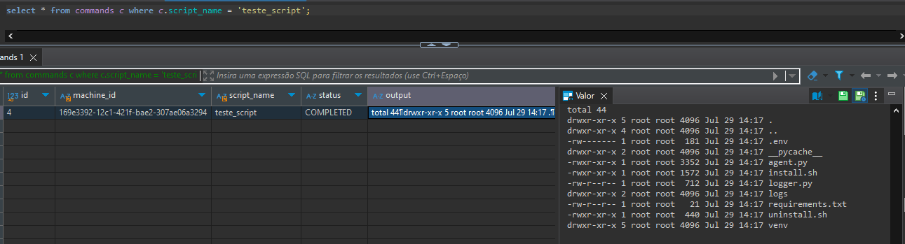

# Sistema de Gerenciamento Remoto de Comandos Linux via Discord

## 🚀 Visão Geral

Este projeto implementa uma solução didática para execução remota de comandos Linux em múltiplas máquinas Ubuntu 22.04, utilizando:

- Um **bot do Discord** para interação com o usuário, através da biblioteca discord.py.
  - Comandos:
    - `!list_machines`
    - `!register_script <nome> <conteudo>`
    - `!execute_script <maquina> <script>`
  - Apenas IDs de usuários autorizados (via .env ou lista no código).
  - Envia requisições HTTP ao serviço web.
- Um **serviço web (API RESTful)** com FastAPI para intermediar comandos e armazenamento no banco de dados PostgreSQL.
  - Endpoints:
    - `GET /machines`
    - `POST /register_machine`
    - `POST /scripts`
    - `POST /execute`
    - `GET /commands/{machine_id}`
    - `POST /commands/{command_id}/result`
  - Usa SQLAlchemy com PostgreSQL.
  - Tabelas:
    - `machines(id, name, last_seen)`
    - `scripts(name, content)`
    - `commands(id, machine_id, script_name, status, output)`
- Um **agente Linux** instalado nas máquinas, executando os comandos agendados através de subprocess no Linux.
  - Executado via `systemd` como serviço.
  - A cada 5 minutos:
    - Envia ping (`POST /register_machine`)
    - Busca comandos (`GET /commands/{machine_id}`)
    - Executa com `subprocess.run`
    - Retorna resultado (`POST /commands/{id}/result`)
  - Configurado via `.env` e UUID salvo no primeiro uso.

---

## 📅 Requisitos

### Gerais

- Python 3.8+
- Bot do Discord criado e configurado através do [Developer Portal](https://discord.com/developers/applications)
- Conta no [Heroku](https://www.heroku.com/) (ou outro host), para hospedagem da API
- Banco de dados PostgreSQL (Ex: [Heroku Postgres](https://www.heroku.com/postgres/), ou local)

<!-- ### Dependências (via `requirements.txt`)

```txt
fastapi
uvicorn
psycopg2-binary
sqlalchemy
aiohttp
python-dotenv
discord.py
``` -->

---

## ⚖️ Estrutura do Projeto

```
/projeto
|--requirements.txt         # Dependências gerais
├── .env.example            # Variáveis de ambiente
├── README.md               # Documentação
├──/api
|  ├──server.py             # API
|  ├──.env.example          # Dependências da API
|  ├──/db              
|  |  └──session.py         # Inicialização da conexão com o banco de dados              
|  ├──/models          
|  |  ├──__init__.py        # Importação das models
|  |  ├──base.py            # Declaração do "BaseModel"
|  |  ├──command.py         # Model da tabela "commands"
|  |  ├──machine.py         # Model da tabela "machines"
|  |  └──script.py          # Model da tabela "scripts"
|  ├──/routes
|  |  └──/dto
|  |     ├──command.py      # Definição dos DTOs para "command"
|  |     ├──machine.py      # Definição dos DTOs para "machine"
|  |     └──script.py       # Definição dos DTOs para "script"
|  └──/utils
|     └──date.py            # Utilitário para cálculo de datas
|
├─/discord_bot
|  ├──bot.py                # Bot do Discord
|  ├──logger.py             # Logger do bot
|  ├──.env.example          # Variáveis de ambiente do bot
|  └──/logs
|     └──app.log            # Logs de execução do bot (Gerado em tempo de execução)
|
├─/linux_agent
|  ├──agent.py              # Bot do Discord
|  ├──logger.py             # Logger do bot
|  ├──.env.example          # Variáveis de ambiente do agent
|  ├──install.sh            # Script de instalação e inicialização do serviço
|  ├──uninstall.sh          # Script de desisnstalação do serviço
|  └──/logs
|     └──app.log          # Logs de execução do serviço (Gerado em tempo de execução)

```

---

## 🌐 Instalação e Configuração

### 1. Bot do Discord

- Criar o bot [Discord Developer Portal](https://discord.com/developers/applications) - [Tutorial](https://discordpy.readthedocs.io/en/stable/discord.html) 
- Gerar token e salvar no seu `/discord_bot/.env`

```
BOT_TOKEN=<seu token>
```
- Convide o bot para o seu servidor do Discord - [Tutorial](https://discordpy.readthedocs.io/en/stable/discord.html#inviting-your-bot)

- Feito isso, seu bot já pode ser executado na sua máquina. Para isso, defina algumas outras variáveis de ambiente no `/discord_bot/.env`:

```
SERVER_URL=<url da sua aplicação Heroku>
AUTHORIZED_USERS=<IDs dos usuários permitidos>
```
A lista de usuários autorizados é definida pelo ID do Discord de cada usuário, separados por ","

### 2. Serviço Web - Heroku

- Faça o download do do [Heroku CLI](https://devcenter.heroku.com/articles/heroku-cli)
- Faça o login no heroku com:
```
$ heroku login
```
- Crie uma aplicação no heroku com:
```
$ heroku create
```
- Faça o push do repositório atual para a aplicação heroku:
```
$ git push heroku master
```
- Feito isso, o aplicativo estará implantado. Para confirmar que ao menos uma instância do app está rodando, faça:
```
$ heroku ps:scale web=1
```
Se você tiver o erro "Couldn't find that process type (web) when running the ps:scale", isso significa que seu app ainda está sendo implantado. Espere alguns minutos e tente novamente.

- Para visualizar os logs da sua aplicação, use:
```
$ heroku logs --tail
```

- Adicionar add-on PostgreSQL para instanciar um banco de dados
```
$ heroku addons:create heroku-postgresql:essential-0
```
Esse comando instancia um banco de dados PostgreSQL no plano "essential-0" (o mais básico do Heroku), e ao fim da instância, a variável DATABASE_URL é definida automaticamente na sua aplicação, você pode confirmar listando todas as variáveis com:
```
$ heroku config
```

Feito isso, sua API deve estar online e funcional para atender às requisições do bot e do serviço linux.

### 3. Agente Linux

- Para instalar o agente linux como serviço em sua máquina, primeiro defina o arquivo `/linux_agent/.env` com:

```
SERVER_URL=<url da sua aplicação Heroku>
MACHINE_NAME=<nome da sua máquina>
ALLOWED_COMMANDS=<lista de comandos permitidos>
```
A lista de comandos permitidos, deve ser informada utilizando ":" como separador de comando/argumentos, "," como separador de argumentos e ";" como separados de comandos/comandos. Como por exemplo:
```
ALLOWED_COMMANDS=ls:*;echo:*;uptime;df:-h
```
Permite que o comando "ls" e "echo" recebam qualquer argumento, o comando "uptime" não recebe argumentos e o comando "df" permite apenas o argumento "-h". 

- Dentro da pasta `linux_agent`, execute o arquivo `install.sh` com permissões de administrador da máquina:
```
$ chmod +x install.sh

$ ./install.sh

🔧 Instalando o agente Discord Linux...
🐍 Criando ambiente virtual...
📦 Instalando dependências no ambiente virtual...
  .
  .
  .
🛠️ Criando serviço systemd...
🚀 Iniciando serviço...
✅ Instalação concluída com sucesso!
```
- Feito isso, o serviço linux estará rodando na sua máquina, o status do mesmo pode ser verificado com:
```
$ sudo systemctl status discord_linux_bot
```


---

## 🔧 Comandos no Discord

#### List machines
```sh
!list_machines
```
Lista todas as máquinas ativas no momento

#### Register script
```
!register_script <nome do script> <comando>
```
Registra script para execução

#### Execute script
```
!execute_script <nome da maquina> <nome do script>
```
Agenda execução de um script em uma máquina

---

## 📈 Testes

- Para testar o funcionamento do sistema, basta acessar o servidor do Discord onde o seu bot se encontra e executar algum dos comandos, como por exemplo "!list_machines":



- Para registrar um script, execute:



- Para agendar a execução do script, faça:



- Feito isso, o script estará agendado para execução na máquina escolhida, e após no máximo 5 minutos, o resultado já estará disponível para consulta.

- Para verificar o resultado do script executado, conecte no seu banco de dados com a ferramenta de sua preferência, e execute o script abaixo:

``` sql
SELECT 
  c.output 
FROM commands c 
WHERE c.script_name = '<nome do script>';
```

- Feito isso, você terá acesso ao resultado da execução do script desejado:


---

## ⚠️ Notas de Segurança

- Sempre usar HTTPS (Heroku já oferece por padrão)
- Validar comandos antes de executar no agente:
  - Na lista de comandos permitidos, evite comandos que possam trazer risco para a sua máquina linux, como por exemplo comandos "rm", "cat", "mv", entre outros, que podem trazer risco e vulnerabilidade para o seu sistema.
- Limitar execução de comandos a usuários autorizados:
  - Adicione uma lista de usuários confiáveis do Discord que podem executar comandos nas máquinas rodando o serviço Linux. Usuários maliciosos podem causar danos irreparáveis ao sistema, se não observador de perto.

---

